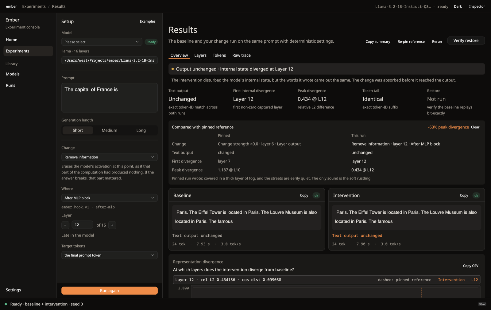
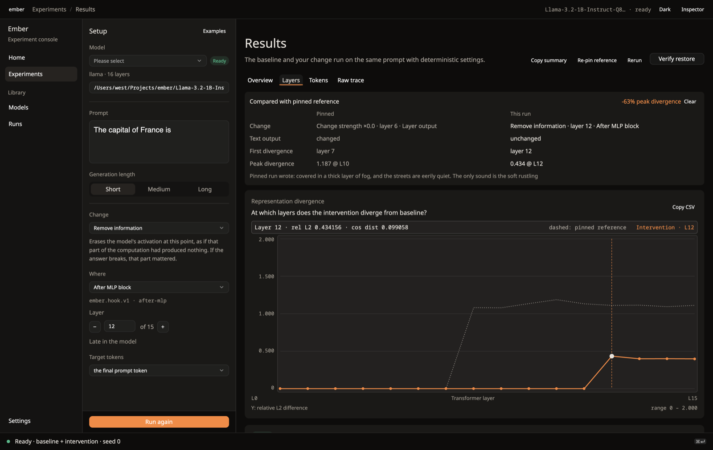

<p align="center"></p>

# ember

[](https://www.rust-lang.org)
[](https://github.com/voidwest/ember/actions/workflows/ci.yml)
[](LICENSE)

Ember runs GGUF on CPU in a way you can inspect and replay. Capture states,
patch them, and pack the run into a bundle you can verify later.

**Inspectable GGUF forward pass → artifacts with checksums → replayable probes and interventions.**

Ember is not a llama.cpp replacement. llama.cpp remains the external
performance and correctness reference; Ember focuses on making the states,
interventions, and evidence behind a model's output inspectable.

**Golden path: Llama-3.2-1B-Instruct Q8_0**, with the model and matching
`tokenizer.json` pinned by SHA-256 in the [example specs](examples/experiments/README.md).
Other execution paths have different [validation coverage](docs/validation.md).

## five-minute workflow

Fetch the pinned model with `scripts/download_models.sh research-example`
and put it in the repository root; Ember does not download models
automatically. The matching `tokenizer.json` is already checked in there (the
[example instructions](examples/experiments/README.md) say where it comes
from). Build once, then capture and verify a run (build and download time are
additional):

```bash
# Inside the checkout, rust-toolchain.toml selects Rust 1.98.1, which the
# default GUI feature needs. A headless build on Rust 1.92 needs
# --no-default-features.
cargo build --release

target/release/ember experiment validate \
  examples/experiments/morphology-layerwise-capture.toml

target/release/ember experiment run \
  examples/experiments/morphology-layerwise-capture.toml

target/release/ember experiment verify runs/morphology-baseline
```

The result is `runs/morphology-baseline`: a verifiable bundle containing
provenance and hidden-state captures across all 16 layers for two token
selections. A mismatched model or tokenizer fails the pinned identity check.

Patch a state and compare the result:

```bash
target/release/ember experiment run \
  examples/experiments/morphology-intervention.toml

target/release/ember experiment compare \
  runs/morphology-baseline runs/morphology-intervention
```

The [full workflow](examples/experiments/README.md) adds restoration and
reproduction. On the reference machine, restoration compares bit-exact and
baseline reproduction reports `exact-semantic`. This is a workflow example,
not a reproduction of a paper result or a promise of cross-machine bit identity.

## the experiment console

Ember ships a native desktop console (`ember gui`) for running the same kind of
intervention without writing a spec. Setup is on the left and results on the
right; change one thing, run again, and pin an earlier result to compare the next
run against it. A result says when the settings have moved on since it was made.





Silencing an early layer's output at the last prompt token turned "Paris. The
Eiffel Tower is located in Paris…" into "covered in a thick layer of fog…" on
Llama-3.2-1B-Instruct Q8_0; the Layers tab shows the change beginning exactly
at the layer that was touched. Zeroing a middle MLP instead leaves the words
unchanged while the internals still diverge. (One deterministic run on a
16-layer model, not a general claim.)

```bash
cargo run --release --bin ember -- gui
# macOS: a double-clickable app with an icon and a menu bar
scripts/bundle-macos.sh && open target/bundle/Ember.app
```

It has a built-in sample result that needs no model, dark and light themes, a
command palette (Cmd+K) and a Presentation mode. Runs are saved and can be
reopened. See the [console notes](docs/v06-gui.md) and the
[demo outline](docs/demo-outline.md).

## why this instrument exists

A probe can read a feature that the model's answer path does not use;
more fitting can even make transfer worse. That distinction motivates capture,
controlled interventions, and replayable evidence. Read
[the probe can read it. can the model use it?](https://voidwest.dev/research-notes/the-probe-can-read-it.html)
for the completed eight-ID diagnostic and its limits.

## research result: quantization-boundary localization

A deterministic validation wave across Qwen2.5-1.5B and Llama-3.2-1B at Q8,
Q6, and Q4 found no evidence of Arabic-selective quantization degradation
in the tested matrix.

The surviving result is methodological: Ember can localize rare
quantization-boundary failures causally. In validated cases, a single-layer
activation patch restored the quantized output, with the causal layer
preceding the visible divergence ramp. The observed mechanism was a
near-threshold decision flip rather than broad representational collapse.

| Model        | Layers | Causal locus |
|--------------|--------|--------------|
| Qwen2.5-1.5B | 28     | L7           |
| Llama-3.2-1B | 16     | L1           |

Validated on the qwen3/llama rows with completed golden checks; see
[docs/validation.md](docs/validation.md) for the full record.

## core documentation

- [CLI usage](docs/usage.md) and [experiment specs and bundles](docs/experiments.md)
- [Support matrix](docs/support.md), [cancellation contract](docs/cancellation.md), and [agent trace schema](docs/trace-schema.md)
- [Model coverage](docs/models.md) and [numerical validation status](docs/validation.md)
- [Architecture](docs/architecture.md), [decode contract](docs/v04-execution-contract.md), and [research contract](docs/v05-research-contract.md)
- [Probing workflows](docs/research.md) and [dataset schemas](docs/dataset_pipeline.md)
- [Compatibility policy](docs/api-stability.md) and [release history](CHANGELOG.md)

The 1.0 priority is capture, intervention, bundles, and verification on a short,
explicitly validated model list. The project remains pre-1.0; an implemented
execution path does not imply completed numerical validation.

## related tools and research

These are optional extensions and separate research tracks around the CLI instrument:

- [Experiment consoles](docs/v06-gui.md): native and browser interfaces to the
  same bundle workflow. The GPUI Kit native GUI uses Metal on macOS and
  a GPU-backed X11/Wayland window on Linux. GUI builds use the pinned Rust
  1.98.1 toolchain; headless builds retain Rust 1.92 support.
- [Agent runtime](docs/agent-runtime.md): tool protocols and auditable traces,
  with their own tool-validation and approval boundaries.
- [EmberSEC](docs/embersec/README.md): hostile-artifact and quantized-fault
  research. The [frozen Phase I evaluation](research/embersec/comparative/README.md)
  retains its corpus, harnesses, results, and hashes as a separate evidence
  record; it is not a security certification of the evolving engine.
  [Phase V lab note: Finite Is Not Intact](https://voidwest.dev/finite-is-not-intact.html):
  the Inf result was a fixture; the operational failure is silent finite drift.
  The measured drift is from synthetic kernels, not a model accuracy drop.
- [Python bindings](bindings/python/README.md), [maintenance audits](docs/audits/README.md),
  and [external benchmarks](docs/external-benchmark.md)
- [Sarf Atlas](https://github.com/voidwest/sarf-atlas): the separate Arabic
  morphology workflow package.

## citation and license

See [CITATION.cff](CITATION.cff) and the [MIT license](LICENSE).
The MIT license covers the code. The Arabic research data derived from UD
Arabic-PADT under `data/arabic_morph_real/` is CC BY-NC-SA 3.0; see its
[notice](data/arabic_morph_real/NOTICE.md).

The actionable [road to 1.0](docs/road-to-1.0.md) tracks release gates and the GPUI Kit console migration.
