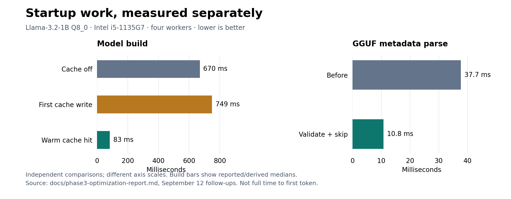

# Where the time goes before the first token

Date: 2026-09-12
Scope: runtime work from 2026-09-05 through 2026-09-12.

Ember's warm Llama-3.2-1B Q8_0 model build went from 670 ms to 83–84 ms
with a persistent packed-weight cache. Steady-state decode throughput stayed
within measurement noise. Separating startup from decode made the useful
optimization visible.

This week's changes also reduced GGUF metadata parsing and per-token
allocation work. The measurements below come from the
[Phase 3 runtime report](phase3-optimization-report.md), including its
September 12 follow-ups. They describe different phases and comparisons;
their speedups cannot be multiplied into an end-to-end claim.

## Measurement boundary

The test host was an Intel Core i5-1135G7 running Arch Linux, with four Rayon
workers pinned to CPUs 0–3. The report records warmups, repeated measurements
and interleaved comparisons. Thermal throttling made small throughput deltas
unreliable, so changes inside the roughly 3% noise band were not counted as
decode wins.

`bench-decode` measures decode separately from loading and prefill. Its load
report now separates mapping, metadata parsing, tensor-table parsing, tensor
materialization and model construction, with packing timings and residency
snapshots. Prefill and first-token timings are reported separately too.

The roughly 8x result below is **warm model-build latency**. It is not a
measurement of full time to first token, cold startup or token throughput.



Figure 1. Lower is better. Each panel has its own millisecond scale. Model
build uses the September 12 cache measurements: cache-off median 670 ms;
first-write samples 746/749/751 ms; warm-hit samples 83/84/83 ms. Metadata
parsing uses the separate five-run interleaved comparison. These are reported
phase measurements, not components of one timed run.

## Packing once, reusing across processes

Q8_0 weights arrive in a row-contiguous representation. Ember's decode kernels
use packed layouts, so constructing the model includes transforming those
weights. An earlier profile attributed 478 ms of a 663 ms model build to VNNI
packing, with another 99 ms in the interleaved output head.

That work was repeated on each process start. The persistent cache stores both
layouts and maps their byte ranges on a validated hit. The ordinary generation
and decode-benchmark paths now enable it by default;
`EMBER_PACKED_CACHE=0` selects the uncached path.

| Llama-3.2-1B Q8_0 configuration | Model build | Cache behavior |
| --- | ---: | --- |
| Cache off | 670 ms median | Pack in memory |
| First run | 746–751 ms | Write 1.31 GiB; 113 misses |
| Warm hit | 83–84 ms | Map packed layouts; 113 hits |

The first write costs time and disk space. On this NVMe host, spaced runs
added about 80 ms over the uncached build. Back-to-back fresh writes under
dirty-writeback pressure took 5–20 seconds. The first-run cost depends on I/O
conditions.

The cache validates identity, layout, bounds and entry lengths. Files are
published by rename after writing a temporary file; cache failures fall back
to in-memory packing. Tests cover byte identity, invalidation, corruption,
truncation and concurrent writers. The measured deterministic Llama output
matches across generic, packed and cached paths.

Directory cleanup uses an 8 GiB default budget, configurable through
`EMBER_PACKED_CACHE_BYTES`, with least-recently-used eviction after successful
publication. The newest file is retained even if it alone exceeds the budget.
There is no free-space pre-check; failed writes degrade to ordinary packing.

Gemma 4 E2B gives a useful second case. After fixing loader limits and tensor
geometry checks, caching its gate/up layouts reduced model build from
2.06–2.28 seconds to 1.54–1.60 seconds. Packing accounts for less of that
constructor, so removing it saves roughly a quarter of the build rather than
the roughly eightfold improvement measured on Llama.

## Validating metadata without keeping unused values

Once packing was cached, metadata processing became more visible. Splitting
the parse timer showed that almost all parsing time was in metadata rather
than the tensor table.

The GGUF tokenizer arrays contained hundreds of thousands of entries that
were being materialized as owned values. Ember loads its tokenizer from
`tokenizer.json`; those four GGUF arrays had no consumers.

The loader now checks element types, counts, string limits, aggregate budgets
and UTF-8 in place, then records `SkippedArray { element_type, elements }`.
It retains the metadata keys and reports the skipped array's type and count
through inspection.

On Llama-1B Q8_0, metadata parsing fell from 37.7 ms to 10.8 ms. In that
comparison, warm command wall time fell from 295 ms to 210 ms. The remaining
parse cost includes walking the individual string lengths.

There was a second source of metadata work: generating the packed-cache key
Debug-formatted every metadata value. Bounding that work reduced warm command
wall time from 342 ms to 274 ms on Llama and from 2,340 ms to 1,927 ms on
Gemma in a separate comparison. These wall-time measurements use different
before/after revisions from the array-skipping comparison.

## Fewer allocations at the same decode speed

The decode work removed repeated plan-cache lookups when the session
configuration is unchanged and made the caller reuse its logits buffer.
The planned Q4 path went from five allocation events and 515,716 allocated
bytes per token to two events and 3,040 bytes. The remaining events were
Rayon job structures under pool contention.

Changing the Llama/Qwen3 CLI decode default from `reference` to `planned`
also made that leaner path the ordinary route. On the measured Llama Q4
workload, the old default used 833 allocations per token; the new default
used two. That larger comparison combines the default change with buffer
reuse. It is not the effect of buffer reuse alone.

The throughput result remained within noise. The final interleaved matrix
measured Q4 planned decode at 27.19 versus 26.90 tokens/s and Q8 at 22.17
versus 22.62 tokens/s. Allocation counts improved substantially without
establishing a throughput improvement.

The default change followed numerical gates: Q4 greedy tokens matched across
24 steps and six frozen prompts, with logits inside the fixed 1e-3 envelope;
18 greedy runs across Q4, Q6 and Q8 also matched byte for byte. The
[execution contract](v04-execution-contract.md) records the decision and
keeps the reference path available. `planned-fused` remains explicit because
its measured throughput advantage over `planned` was also within noise.

## What remains

The decode profile still places about 87% of sampled cycles in the two
K-quant dot kernels. The startup changes do not remove that work. Further
kernel experiments need stable host conditions and a fresh comparison against
the existing path.

The practical gain this week is that repeated launches reuse expensive
packing, the loader avoids retaining unused metadata, and ordinary decode
uses fewer allocations. Each result has a separate measurement boundary and
correctness check. Keeping those boundaries visible makes the next bottleneck
easier to identify.

## Sources and figure reproduction

- [Phase 3 runtime report](phase3-optimization-report.md): measurements,
  protocols, correctness checks and September 12 follow-ups.

- [Execution contract](v04-execution-contract.md): planned-default and
  planned-fused decision amendments.

The figure is generated from the reported values, without rerunning inference:

```sh
MPLCONFIGDIR=/tmp/ember-post-matplotlib python docs/assets/plot_startup_phase_timings.py
```
