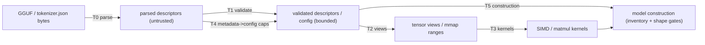

# EmberSEC comparative evaluation — synthesis

Frozen artifacts: FROZEN_ARTIFACTS.md. Data: results/*.json (62-case
corpus) + results/diff_fuzz/summary_raw-10000-7.json and
summary_construction-2000-11.json. Figures:
figures/fig{1,2,3}_*.png. Tables: tables/A..G.

## 1. Limitations (read before interpreting anything)

1. **Corpus composition**: the 62-case corpus is adversarial-fixture
   based (regression fixtures, reconstructed fuzz artifacts, canonical
   synthetics). It demonstrates failure classes and bounded rejection,
   NOT failure rates; rate statements come only from the mutation runs.
2. **Mutation-space coverage**: the 10,000-mutation run exercised
   parser/extent/layout paths densely but reached the model-construction
   semantic layer only rarely (mutations usually break the file earlier);
   the deterministic corpus delta is the evidence for construction-layer
   classes, not mutation density.
3. **llama.cpp harness**: the final matrix is driven through the b7999
   loader API (no generation), so parse-level acceptance is a direct return
   value rather than stderr inference. Release build: GGML_ASSERT is always
   compiled in (unlike NDEBUG asserts), so assert aborts are observable; a
   debug-assert-only failure mode would not be.
4. **Candle comparability**: parser-level only
   (`gguf_file::Content::read`); no tensor-data load, no model
   construction. "ACCEPT" for candle means "parsed structure"; it is
   not comparable on semantic/config classes (marked accordingly).
5. **Single-commit external observations**: llama.cpp results are for
   pristine b7999 (`0c1f39a9`) via the loader harness; the zero-dimension
   and empty-key crash classes were also reproduced on b5998/b5999, but no
   wider range was tested. Candle is crates.io 0.11.0 only.
6. **Host**: thermally noisy 16 GB machine; timings are medians of 3,
   not microbenchmarks; no memory-pressure isolation from the GUI/other
   processes.
7. **No memory-safety claim**: crash findings (SIGFPE, asserts, panics)
   are crash/resource findings. No exploit or memory-corruption
   investigation was performed for any runtime, including Ember.
8. **Tokenizers**: the tokenizer boundary uses the `tokenizers` crate
   with a panic-containment boundary; upstream panics beyond the
   demonstrated class remain possible in principle (documented).
9. **Not a security certification**: this evaluation supports a
   comparative research claim about failure classes and bounded
   rejection; it does not certify any runtime.

## 2. Trust-boundary model

See docs/embersec/threat-model.md for the full model.

The evaluation measures what happens when the T0-T6 gates are
*(not) present: the baseline (T1/T4/T5 procedural-only) vs the hardened
runtime (type-level validated descriptors, named caps, inventory gate,
tokenizer containment).

## 3. Compact taxonomy of the 15 findings

| # | finding | class | boundary | evidence | status |
|---|---|---|---|---|---|
| 1 | K-quant eager path accepts dims[0] % 256 != 0 (non-compliant dequant order) | D | T1 | behavioral (fixture) | fixed at gate |
| 2 | Q8_0 contiguous-dim misalignment accepted by loader | D | T1 | behavioral (fixture) | fixed at gate |
| 3 | odd `key_length` panics `compute_rope_freqs` | C+E | T4/T5 | fuzz artifact | fixed (evenness) |
| 4 | gemma4 `rope_freqs.weight` hostile length/values panic | D+E | T5 | reviewed | fixed (validated) |
| 5 | 1-D F32 linear weights panic transpose | D+E | T5 | reviewed | fixed (rank check) |
| 6 | `context_length = u32::MAX` multi-TB rope alloc | C+G | T4 | arithmetic+observed thrash | fixed (caps) |
| 7 | rope table product gap (16M x 4096) | G | T4 | arithmetic | fixed (product cap) |
| 8 | `block_count = 1M` block-vector sizing | C+G | T4 | arithmetic | fixed (caps) |
| 9 | tokenizers-0.20.4 `.expect("Helper")` panic | F | T6 | 26-B fuzz artifact | contained at boundary |
| 10 | tokenizer file-size unbounded read | G | T6 | arithmetic | fixed (cap) |
| 11 | raw descriptors flow into views (no validated type) | I | T1/T2 | structural | fixed (ValidatedTensorInfo) |
| 12 | raw-slice pub SIMD entry | I | T3 | structural | fixed (Q8WeightView) |
| 13 | undocumented count heuristics, no abs caps | G | T0/T1 | theoretical | fixed (named limits) |
| 14 | implicit u32->usize metadata casts | C | T4 | theoretical | fixed (explicit caps) |
| 15 | Oniguruma regex ReDoS at encode | G | T6 | theoretical | documented, open |

Evidence strength: rows 1-3, 5-10 confirmed (panic/behavior/gap
demonstrated); 4 confirmed-by-review (assert reachable); 11-12
structural weakness (no memory error demonstrated); 13-15 theoretical.

## 4. Results

### 4.1 Before/after (62-case corpus)

| outcome | baseline `1157277` | EmberSEC `1509986` |
|---|---|---|
| ACCEPT | 15 | 14 |
| STRUCTURED_REJECT | 40 | 48 |
| PANIC | 5 | 0 |
| PROCESS_CRASH | 1 | 0 |
| TIMEOUT | 1 | 0 |

8 of 62 cases changed, all failures -> structured rejection
(tables/B_baseline_vs_current.md, figures/fig2_delta.png); the other 54
are unchanged, including all 14 valid controls (figures/fig1_outcomes.png).

### 4.2 Failure classes across runtimes (machine-derived)

| class | baseline | EmberSEC | llama.cpp b7999 | candle 0.11 |
|---|---|---|---|---|
| semantic config panic | PANIC | reject | reject* | accept+ |
| layout misinterpretation | accept (misinterp) | reject | reject (block-align) | accept+ |
| resource amplification | TIMEOUT/CRASH | reject | reject* | accept+ |
| zero-dim crash | reject | reject | **crash (SIGFPE)** | accept+ |
| empty metadata key | reject | reject | **crash (assert)** | accept+ |
| alignment zero | reject | reject | reject | **panic** |

* llama.cpp rejects these fixtures at model construction because the
minimal files lack hparams — its config layer is not exercised (see
section 6 decision). + candle is parser-level only: "accept" means
structure parsed; tensor data and model construction are not exercised.

### 4.3 Differential fuzzing (sequential, per-case-logged; figures/fig3_diff_fuzz.png)

Raw campaign (10,000 mutations, seed 7):

| target | failures / 10,000 | classes |
|---|---|---|
| ember-baseline | 0 | (raw mutations do not reach the semantic layer) |
| ember-current | 0 | — |
| llama.cpp b7999 | 201 (2.0%) | 197 crash (empty-key assert, zero-dim SIGFPE) + 4 timeout (S3 string-length hang) |
| candle 0.11 | 6 | alignment-zero div_ceil(0) panic (S4) |

Construction-layer campaign (2,000 config-only mutations of the valid
models, seed 11) — the layer where config semantics live:

| target | failures / 2,000 | classes |
|---|---|---|
| ember-baseline | 194 (9.7%) | 89 PANIC (odd head dim) + 61 TIMEOUT (huge context thrash) + 44 PROCESS_CRASH (huge count alloc) |
| ember-current | 0 | all converted to structured rejection (one residual O(n) pre-cap allocation found and fixed) |
| llama.cpp b7999 | 35 (1.8%) | 32 crash incl. NEW GGML_ABORT on block_count=0 (S5) + 3 timeout |
| candle 0.11 | 0 | parser-level only; config not exercised |

## 5. Interpretation

- **What the hardening changed**: eight failure cases spanning five
  taxonomy classes (C/D/E/F/G) became bounded structured rejection at
  the layer where they originate (T1/T4/T5/T6), with zero change to
  accepted-input behavior and no measurable load-cost increase
  (10.4 ms reject vs 10.5 ms valid load; 1.77 s vs 2.03 s real-model
  load).
- **What the hardening did NOT change**: the pre-EmberSEC fail-closed
  parser checks were already sound (bounds, counts, strings, rank,
  overlap, dtype); the baseline's 7 failure cases were all at the
  semantic/config/construction/tokenizer layers, matching the
  architecture's claim that validation belongs at the trust boundary,
  not in the parser.
- **Comparators**: llama.cpp b7999 crashed on 2.0% of raw mutations and
  1.8% of construction mutations (three classes; the zero-dimension and
  empty-key classes also span b5998-b5999) and rejects the same
  malformed structures Ember rejects (including the block-alignment rule
  baseline Ember violated). Candle's parser accepts most malformed
  structures and panics on alignment-zero. No comparator was found to
  have strictly worse behavior on every class; each has its own
  boundary profile.

## 6. Decision: one more targeted experiment

The draft's weakest cell is the llama.cpp column for the semantic-config
and resource-amplification rows: the minimal fixtures never reach
llama.cpp's config layer, so "reject*" is not evidence about its
config handling. The new valid models (gguf-050/051) DO reach it.

EXECUTED: the construction-layer campaign (section 4.3) filled the
draft's weakest cells: baseline Ember fails 9.7% of config mutations at
this layer, current Ember 0.0%, and llama.cpp's config layer adds a new
crash class (S5, GGML_ABORT on block_count=0). One residual Ember issue
was found and fixed (gemma4 pre-cap O(n_layers) allocation: 3.8 s
rejection on 2^32-1 layers, now constant-time). No further experiment is
needed for the current claim; a follow-up could extend the construction
campaign to qwen3/gemma4 config slots at higher n for per-field rates.
